# YARN资源管理架构指南

## 概述

YARN（Yet Another Resource Negotiator）是Hadoop 2.0引入的资源管理系统，它将资源管理和作业调度分离，使Hadoop能够支持更多类型的应用程序，不仅仅是MapReduce。

## YARN的诞生背景

### Hadoop 1.x的局限性

在Hadoop 1.x中，JobTracker承担了太多职责：
- **资源管理**: 管理集群中的计算资源
- **作业调度**: 决定作业的执行顺序
- **作业监控**: 监控作业的执行状态
- **任务调度**: 将任务分配给TaskTracker

这种设计导致了以下问题：
1. **单点故障**: JobTracker故障会导致整个集群不可用
2. **扩展性限制**: 单个JobTracker难以管理大规模集群
3. **资源利用率低**: 静态的slot分配导致资源浪费
4. **只支持MapReduce**: 无法运行其他类型的应用

### YARN的解决方案

YARN通过以下方式解决了这些问题：
- **职责分离**: 将资源管理和作业调度分离
- **多应用支持**: 支持MapReduce、Spark、Flink等多种应用
- **动态资源分配**: 根据需求动态分配资源
- **高可用性**: 支持ResourceManager的高可用配置

## YARN架构组件

### YARN整体架构图

```
┌─────────────────────────────────────────────────────────────────┐
│                        YARN 集群架构                              │
├─────────────────────────────────────────────────────────────────┤
│  Client                                                         │
│    │                                                            │
│    │ 1. 提交应用                                                  │
│    ▼                                                            │
│ ┌─────────────────────────────────────────────────────────────┐ │
│ │                ResourceManager (RM)                        │ │
│ │  ┌─────────────────┐    ┌─────────────────────────────────┐ │ │
│ │  │   Scheduler     │    │    ApplicationsManager         │ │ │
│ │  │                 │    │                                 │ │ │
│ │  │ • FIFO         │    │ • 应用提交处理                   │ │ │
│ │  │ • Capacity     │    │ • AM启动管理                    │ │ │
│ │  │ • Fair         │    │ • 应用状态跟踪                   │ │ │
│ │  └─────────────────┘    └─────────────────────────────────┘ │ │
│ └─────────────────────────────────────────────────────────────┘ │
│                              │                                  │
│                              │ 2. 启动AM                        │
│                              ▼                                  │
│ ┌─────────────────────────────────────────────────────────────┐ │
│ │                    NodeManager 1                           │ │
│ │  ┌─────────────────┐    ┌─────────────────────────────────┐ │ │
│ │  │ ApplicationMaster│    │        Containers              │ │ │
│ │  │                 │    │                                 │ │ │
│ │  │ • 资源协商       │    │ ┌─────┐ ┌─────┐ ┌─────┐        │ │ │
│ │  │ • 任务调度       │    │ │Task1│ │Task2│ │Task3│        │ │ │
│ │  │ • 进度监控       │    │ └─────┘ └─────┘ └─────┘        │ │ │
│ │  └─────────────────┘    └─────────────────────────────────┘ │ │
│ └─────────────────────────────────────────────────────────────┘ │
│                                                                 │
│ ┌─────────────────────────────────────────────────────────────┐ │
│ │                    NodeManager 2                           │ │
│ │  ┌─────────────────────────────────────────────────────────┐ │ │
│ │  │                    Containers                          │ │ │
│ │  │                                                         │ │ │
│ │  │ ┌─────┐ ┌─────┐ ┌─────┐ ┌─────┐                      │ │ │
│ │  │ │Task4│ │Task5│ │Task6│ │Task7│                      │ │ │
│ │  │ └─────┘ └─────┘ └─────┘ └─────┘                      │ │ │
│ │  └─────────────────────────────────────────────────────────┘ │ │
│ └─────────────────────────────────────────────────────────────┘ │
│                                                                 │
│ ┌─────────────────────────────────────────────────────────────┐ │
│ │                    NodeManager N                           │ │
│ │  ┌─────────────────────────────────────────────────────────┐ │ │
│ │  │                    Containers                          │ │ │
│ │  │                                                         │ │ │
│ │  │ ┌─────┐ ┌─────┐ ┌─────┐                               │ │ │
│ │  │ │TaskX│ │TaskY│ │TaskZ│                               │ │ │
│ │  │ └─────┘ └─────┘ └─────┘                               │ │ │
│ │  └─────────────────────────────────────────────────────────┘ │ │
│ └─────────────────────────────────────────────────────────────┘ │
└─────────────────────────────────────────────────────────────────┘
```

### 1. ResourceManager (RM)

ResourceManager是YARN的核心组件，负责整个集群的资源管理。

#### ResourceManager内部架构图

```
┌─────────────────────────────────────────────────────────────┐
│                    ResourceManager                         │
├─────────────────────────────────────────────────────────────┤
│                                                             │
│  ┌─────────────────┐              ┌─────────────────────────┐│
│  │   Client API    │              │    Admin API           ││
│  │                 │              │                         ││
│  │ • 应用提交       │              │ • 队列管理               ││
│  │ • 状态查询       │              │ • 节点管理               ││
│  │ • 应用控制       │              │ • 配置刷新               ││
│  └─────────────────┘              └─────────────────────────┘│
│           │                                   │              │
│           ▼                                   ▼              │
│  ┌─────────────────────────────────────────────────────────┐ │
│  │              ApplicationsManager                       │ │
│  │                                                         │ │
│  │ • 应用提交验证     • AM启动管理     • 应用状态跟踪        │ │
│  │ • 安全认证         • AM故障恢复     • 应用历史记录        │ │
│  └─────────────────────────────────────────────────────────┘ │
│                              │                              │
│                              ▼                              │
│  ┌─────────────────────────────────────────────────────────┐ │
│  │                    Scheduler                           │ │
│  │                                                         │ │
│  │  ┌─────────────┐  ┌─────────────┐  ┌─────────────────┐  │ │
│  │  │FIFO调度器   │  │容量调度器   │  │公平调度器       │  │ │
│  │  │             │  │             │  │                 │  │ │
│  │  │• 简单队列   │  │• 多队列支持 │  │• 公平共享       │  │ │
│  │  │• 先进先出   │  │• 资源保证   │  │• 抢占机制       │  │ │
│  │  └─────────────┘  └─────────────┘  └─────────────────┘  │ │
│  └─────────────────────────────────────────────────────────┘ │
│                              │                              │
│                              ▼                              │
│  ┌─────────────────────────────────────────────────────────┐ │
│  │              Resource Tracker                          │ │
│  │                                                         │ │
│  │ • 节点资源监控     • 心跳处理       • 资源状态更新      │ │
│  │ • 节点健康检查     • 容器分配       • 集群资源统计      │ │
│  └─────────────────────────────────────────────────────────┘ │
└─────────────────────────────────────────────────────────────┘
```

#### 主要功能
- **资源分配**: 根据应用需求分配集群资源
- **应用管理**: 管理应用的生命周期
- **调度决策**: 决定资源分配给哪个应用
- **故障恢复**: 处理NodeManager和ApplicationMaster的故障

#### 核心子组件

##### Scheduler（调度器）
```
调度器类型：
├── FIFO Scheduler（先进先出）
│   ├── 简单的队列调度
│   └── 适用于小集群
├── Capacity Scheduler（容量调度器）
│   ├── 多队列支持
│   ├── 资源保证和限制
│   └── 弹性资源分配
└── Fair Scheduler（公平调度器）
    ├── 公平共享资源
    ├── 抢占机制
    └── 动态队列创建
```

##### ApplicationsManager（应用管理器）
- 接收应用提交请求
- 启动ApplicationMaster
- 监控ApplicationMaster状态
- 重启失败的ApplicationMaster

### 2. NodeManager (NM)

NodeManager运行在集群的每个节点上，负责该节点的资源管理。

#### NodeManager内部架构图

```
┌─────────────────────────────────────────────────────────────┐
│                    NodeManager                             │
├─────────────────────────────────────────────────────────────┤
│                                                             │
│  ┌─────────────────┐              ┌─────────────────────────┐│
│  │NodeStatusUpdater│              │   NodeHealthChecker    ││
│  │                 │              │                         ││
│  │ • 心跳发送       │              │ • 磁盘检查               ││
│  │ • 状态报告       │              │ • 内存检查               ││
│  │ • 指令接收       │              │ • 网络检查               ││
│  └─────────────────┘              └─────────────────────────┘│
│           │                                   │              │
│           ▼                                   ▼              │
│  ┌─────────────────────────────────────────────────────────┐ │
│  │              ContainerManager                          │ │
│  │                                                         │ │
│  │ ┌─────────────┐  ┌─────────────┐  ┌─────────────────┐  │ │
│  │ │容器启动     │  │容器监控     │  │容器清理         │  │ │
│  │ │             │  │             │  │                 │  │ │
│  │ │• 资源分配   │  │• 资源使用   │  │• 进程终止       │  │ │
│  │ │• 进程启动   │  │• 状态跟踪   │  │• 资源回收       │  │ │
│  │ └─────────────┘  └─────────────┘  └─────────────────┘  │ │
│  └─────────────────────────────────────────────────────────┘ │
│                              │                              │
│                              ▼                              │
│  ┌─────────────────────────────────────────────────────────┐ │
│  │              ContainerExecutor                         │ │
│  │                                                         │ │
│  │  ┌─────────────┐  ┌─────────────┐  ┌─────────────────┐  │ │
│  │  │默认执行器   │  │Linux执行器  │  │Docker执行器     │  │ │
│  │  │             │  │             │  │                 │  │ │
│  │  │• 基本隔离   │  │• CGroups   │  │• 容器化隔离     │  │ │
│  │  │• 进程管理   │  │• 用户隔离   │  │• 镜像管理       │  │ │
│  │  └─────────────┘  └─────────────┘  └─────────────────┘  │ │
│  └─────────────────────────────────────────────────────────┘ │
│                              │                              │
│                              ▼                              │
│  ┌─────────────────────────────────────────────────────────┐ │
│  │                 Local Resources                        │ │
│  │                                                         │ │
│  │ ┌─────────┐ ┌─────────┐ ┌─────────┐ ┌─────────────────┐ │ │
│  │ │Container│ │Container│ │Container│ │    Log Files    │ │ │
│  │ │   #1    │ │   #2    │ │   #3    │ │                 │ │ │
│  │ │         │ │         │ │         │ │ • stdout/stderr │ │ │
│  │ │ 2GB RAM │ │ 1GB RAM │ │ 4GB RAM │ │ • 应用日志       │ │ │
│  │ │ 1 vCore │ │ 1 vCore │ │ 2 vCore │ │ • 系统日志       │ │ │
│  │ └─────────┘ └─────────┘ └─────────┘ └─────────────────┘ │ │
│  └─────────────────────────────────────────────────────────┘ │
└─────────────────────────────────────────────────────────────┘
```

#### 主要功能
- **容器管理**: 启动、监控和停止容器
- **资源监控**: 监控节点的CPU、内存使用情况
- **日志管理**: 收集和管理应用日志
- **健康检查**: 定期向ResourceManager报告节点状态

#### 核心组件
```
NodeManager组件：
├── ContainerManager
│   ├── 容器生命周期管理
│   └── 资源隔离和限制
├── NodeHealthChecker
│   ├── 节点健康状态检查
│   └── 磁盘、网络状态监控
├── NodeStatusUpdater
│   ├── 向RM报告节点状态
│   └── 接收RM的指令
└── ContainerExecutor
    ├── 容器进程启动
    └── 安全隔离
```

### 3. ApplicationMaster (AM)

ApplicationMaster是每个应用的"大脑"，负责协调应用的执行。

#### ApplicationMaster架构图

```
┌─────────────────────────────────────────────────────────────┐
│                  ApplicationMaster                         │
├─────────────────────────────────────────────────────────────┤
│                                                             │
│  ┌─────────────────┐              ┌─────────────────────────┐│
│  │  RM Communicator│              │   Task Scheduler        ││
│  │                 │              │                         ││
│  │ • 资源请求       │              │ • 任务分配               ││
│  │ • 心跳发送       │              │ • 负载均衡               ││
│  │ • 状态报告       │              │ • 优先级管理             ││
│  └─────────────────┘              └─────────────────────────┘│
│           │                                   │              │
│           ▼                                   ▼              │
│  ┌─────────────────────────────────────────────────────────┐ │
│  │              Resource Manager                          │ │
│  │                                                         │ │
│  │ • 资源需求计算     • 容器请求生成     • 资源分配跟踪      │ │
│  │ • 数据本地性优化   • 资源利用率监控   • 动态资源调整      │ │
│  └─────────────────────────────────────────────────────────┘ │
│                              │                              │
│                              ▼                              │
│  ┌─────────────────────────────────────────────────────────┐ │
│  │              Task Monitor                              │ │
│  │                                                         │ │
│  │  ┌─────────────┐  ┌─────────────┐  ┌─────────────────┐  │ │
│  │  │进度跟踪     │  │故障检测     │  │性能监控         │  │ │
│  │  │             │  │             │  │                 │  │ │
│  │  │• 任务状态   │  │• 超时检测   │  │• 资源使用       │  │ │
│  │  │• 完成度统计 │  │• 异常捕获   │  │• 吞吐量统计     │  │ │
│  │  └─────────────┘  └─────────────┘  └─────────────────┘  │ │
│  └─────────────────────────────────────────────────────────┘ │
│                              │                              │
│                              ▼                              │
│  ┌─────────────────────────────────────────────────────────┐ │
│  │              Container Launcher                        │ │
│  │                                                         │ │
│  │ ┌─────────┐ ┌─────────┐ ┌─────────┐ ┌─────────────────┐ │ │
│  │ │Container│ │Container│ │Container│ │   Failed Tasks  │ │ │
│  │ │ Launch  │ │ Monitor │ │ Stop    │ │                 │ │ │
│  │ │         │ │         │ │         │ │ • 重试机制       │ │ │
│  │ │• 启动命令│ │• 状态监控│ │• 清理资源│ │ • 故障转移       │ │ │
│  │ │• 环境配置│ │• 日志收集│ │• 结果收集│ │ • 黑名单管理     │ │ │
│  │ └─────────┘ └─────────┘ └─────────┘ └─────────────────┘ │ │
│  └─────────────────────────────────────────────────────────┘ │
└─────────────────────────────────────────────────────────────┘
```

#### 主要功能
- **资源请求**: 向ResourceManager请求资源
- **任务调度**: 将任务分配给获得的容器
- **进度监控**: 监控任务执行进度
- **故障处理**: 处理任务失败和重试

#### 生命周期
```
ApplicationMaster生命周期：
1. 应用提交 → ResourceManager
2. ResourceManager启动ApplicationMaster
3. ApplicationMaster向ResourceManager注册
4. ApplicationMaster请求资源
5. ResourceManager分配容器
6. ApplicationMaster启动任务
7. 任务执行完成
8. ApplicationMaster注销并退出
```

### 4. Container（容器）

Container是YARN中资源分配的基本单位。

#### Container架构图

```
┌─────────────────────────────────────────────────────────────┐
│                      Container                             │
├─────────────────────────────────────────────────────────────┤
│                                                             │
│  ┌─────────────────┐              ┌─────────────────────────┐│
│  │  Resource Spec  │              │    Security Context     ││
│  │                 │              │                         ││
│  │ • Memory: 2GB   │              │ • User: yarn            ││
│  │ • vCores: 2     │              │ • Group: hadoop         ││
│  │ • Priority: 1   │              │ • Permissions: 755      ││
│  └─────────────────┘              └─────────────────────────┘│
│           │                                   │              │
│           ▼                                   ▼              │
│  ┌─────────────────────────────────────────────────────────┐ │
│  │              Launch Context                            │ │
│  │                                                         │ │
│  │ • 启动命令: java -Xmx1024m MyApp                        │ │
│  │ • 环境变量: JAVA_HOME, HADOOP_CONF_DIR                  │ │
│  │ • 本地资源: app.jar, config.xml                         │ │
│  │ • 工作目录: /tmp/hadoop-yarn/container_xxx               │ │
│  └─────────────────────────────────────────────────────────┘ │
│                              │                              │
│                              ▼                              │
│  ┌─────────────────────────────────────────────────────────┐ │
│  │              Process Management                        │ │
│  │                                                         │ │
│  │  ┌─────────────┐  ┌─────────────┐  ┌─────────────────┐  │ │
│  │  │进程启动     │  │资源监控     │  │进程控制         │  │ │
│  │  │             │  │             │  │                 │  │ │
│  │  │• fork/exec  │  │• CPU使用率  │  │• 信号处理       │  │ │
│  │  │• 环境设置   │  │• 内存使用量 │  │• 进程终止       │  │ │
│  │  │• 权限设置   │  │• 磁盘I/O    │  │• 资源清理       │  │ │
│  │  └─────────────┘  └─────────────┘  └─────────────────┘  │ │
│  └─────────────────────────────────────────────────────────┘ │
│                              │                              │
│                              ▼                              │
│  ┌─────────────────────────────────────────────────────────┐ │
│  │              Resource Isolation                        │ │
│  │                                                         │ │
│  │ ┌─────────┐ ┌─────────┐ ┌─────────┐ ┌─────────────────┐ │ │
│  │ │ CGroups │ │ Chroot  │ │Network  │ │   File System   │ │ │
│  │ │         │ │         │ │         │ │                 │ │ │
│  │ │• CPU限制│ │• 文件系统│ │• 网络隔离│ │ • 本地目录       │ │ │
│  │ │• 内存限制│ │• 根目录  │ │• 端口管理│ │ • 日志文件       │ │ │
│  │ │• I/O限制│ │• 权限隔离│ │• 带宽控制│ │ • 临时文件       │ │ │
│  │ └─────────┘ └─────────┘ └─────────┘ └─────────────────┘ │ │
│  └─────────────────────────────────────────────────────────┘ │
└─────────────────────────────────────────────────────────────┘
```

#### 容器特性
- **资源封装**: 封装CPU、内存等资源
- **进程隔离**: 提供进程级别的隔离
- **生命周期管理**: 由NodeManager管理
- **动态分配**: 根据需求动态创建和销毁

#### 容器规格
```java
// 容器资源规格示例
Resource containerResource = Resource.newInstance(
    1024,  // 内存 (MB)
    1      // CPU核心数
);

// 容器优先级
Priority priority = Priority.newInstance(1);

// 容器请求
ContainerRequest containerRequest = new ContainerRequest(
    containerResource,
    null,  // 节点偏好
    null,  // 机架偏好
    priority
);
```

## YARN工作流程

### YARN工作流程概述

YARN（Yet Another Resource Negotiator）的工作流程可以分为四个主要阶段：

1. **应用提交阶段**: 客户端提交应用到ResourceManager
2. **资源协商阶段**: ApplicationMaster与ResourceManager协商资源
3. **任务执行阶段**: 在分配的容器中执行具体任务
4. **应用完成阶段**: 清理资源并返回结果

### YARN完整工作流程图

#### 时序图表示

```mermaid
sequenceDiagram
    participant Client
    participant RM as ResourceManager
    participant NM1 as NodeManager1
    participant NM2 as NodeManager2
    participant AM as ApplicationMaster
    
    Note over Client,AM: 应用提交阶段
    Client->>RM: 1. 提交应用(ApplicationSubmissionContext)<br/>📝 WordCountDriver.main() → Job.getInstance()
    RM->>RM: 2. 验证权限和资源<br/>📝 HadoopConfigManager.configureHadoop()
    RM->>Client: 3. 返回ApplicationId<br/>📝 job.getJobID()
    RM->>NM1: 4. 启动ApplicationMaster<br/>📝 mapreduce.framework.name=yarn
    NM1->>AM: 5. 创建AM容器<br/>📝 job.setJarByClass(WordCountDriver.class)
    AM->>RM: 6. 注册ApplicationMaster<br/>📝 job.submit() 内部触发
    
    Note over Client,AM: 资源协商阶段
    AM->>RM: 7. 请求容器资源<br/>📝 job.setMapperClass() + setReducerClass()
    RM->>RM: 8. 调度器分配资源<br/>📝 job.setPriority() + setNumReduceTasks()
    RM->>AM: 9. 返回分配的容器<br/>📝 progressmonitor.pollinterval 配置
    
    Note over Client,AM: 任务执行阶段
    AM->>NM1: 10. 启动容器1<br/>📝 FileInputFormat.addInputPath()
    AM->>NM2: 11. 启动容器2<br/>📝 FileOutputFormat.setOutputPath()
    NM1->>AM: 12. 容器1状态报告<br/>📝 WordCountMapper 执行
    NM2->>AM: 13. 容器2状态报告<br/>📝 WordCountReducer 执行
    AM->>RM: 14. 应用进度报告<br/>📝 job.getTrackingURL()
    RM->>Client: 15. 状态更新<br/>📝 监控URL输出
    
    Note over Client,AM: 应用完成阶段
    AM->>RM: 16. 报告应用完成<br/>📝 printJobStatistics() 可选
    RM->>NM1: 17. 清理AM容器<br/>📝 fs.delete(outputDir) 清理
    RM->>Client: 18. 返回应用结果<br/>📝 System.exit(success ? 0 : 1)
```



#### 流程步骤详解（结合代码实现）

**阶段1: 应用提交**
1. **Client提交应用**: 客户端创建ApplicationSubmissionContext，包含应用信息、资源需求等
   ```java
   // WordCountDriver.java - main方法
   Configuration conf = new Configuration();
   String[] otherArgs = new GenericOptionsParser(conf, args).getRemainingArgs();
   boolean success = runWordCountJob(conf, inputPath, outputPath);
   ```

2. **权限验证**: ResourceManager验证用户权限和资源配额
   ```java
   // HadoopConfigManager.java - configureHadoop方法
   String hadoopUser = getProperty("hadoop.user.name", "hadoop");
   System.setProperty("HADOOP_USER_NAME", hadoopUser);
   ```

3. **分配ID**: 为应用分配唯一的ApplicationId
   ```java
   // WordCountDriver.java - runWordCountJob方法
   Job job = Job.getInstance(conf, "word count");
   job.setJarByClass(WordCountDriver.class);
   ```

4. **选择节点**: ResourceManager选择合适的NodeManager启动ApplicationMaster
   ```java
   // HadoopConfigManager.java - YARN配置
   String rmHostname = getProperty("yarn.resourcemanager.hostname");
   conf.set("yarn.resourcemanager.hostname", rmHostname);
   ```

5. **启动AM**: NodeManager启动ApplicationMaster容器
   ```java
   // WordCountDriver.java - MapReduce框架配置
   String mrFramework = getProperty("mapreduce.framework.name", "yarn");
   conf.set("mapreduce.framework.name", mrFramework);
   ```

6. **AM注册**: ApplicationMaster向ResourceManager注册并获取集群信息
   ```java
   // WordCountDriver.java - 作业提交
   job.submit(); // 内部会触发AM注册过程
   logger.info("Job ID: " + job.getJobID());
   ```

**阶段2: 资源协商**
7. **资源请求**: ApplicationMaster根据任务需求向ResourceManager请求容器资源
   ```java
   // WordCountDriver.java - 设置Mapper和Reducer
   job.setMapperClass(WordCountMapper.class);
   job.setReducerClass(WordCountReducer.class);
   job.setNumReduceTasks(2); // 设置Reduce任务数量
   ```

8. **资源调度**: ResourceManager的调度器根据策略分配资源
   ```java
   // WordCountDriver.java - 作业优先级和队列配置
   job.setPriority(org.apache.hadoop.mapreduce.JobPriority.NORMAL);
   // job.setQueueName("default"); // 可选：设置队列
   ```

9. **分配响应**: ResourceManager返回分配的容器信息给ApplicationMaster
   ```java
   // HadoopConfigManager.java - 监控配置
   long pollInterval = getLongProperty("mapreduce.client.progressmonitor.pollinterval", 10000);
   conf.setLong("mapreduce.client.progressmonitor.pollinterval", pollInterval);
   ```

**阶段3: 任务执行**
10-11. **启动容器**: ApplicationMaster在分配的NodeManager上启动任务容器
   ```java
   // WordCountDriver.java - 输入输出配置
   FileInputFormat.addInputPath(job, new Path(inputPath));
   FileOutputFormat.setOutputPath(job, outputDir);
   job.setInputFormatClass(TextInputFormat.class);
   job.setOutputFormatClass(TextOutputFormat.class);
   ```

12-13. **执行任务**: 各个容器中的任务开始执行业务逻辑
   ```java
   // WordCountMapper.java 和 WordCountReducer.java
   // 实际的Map和Reduce逻辑在这些类中实现
   job.setOutputKeyClass(Text.class);
   job.setOutputValueClass(IntWritable.class);
   ```

14-15. **状态报告**: NodeManager定期向ApplicationMaster报告任务执行状态
   ```java
   // WordCountDriver.java - 作业跟踪
   logger.info("Job tracking URL: " + job.getTrackingURL());
   logger.info("Monitor at: http://10.132.144.24:8088/cluster/app/" + 
              job.getJobID().toString().replace("job_", "application_"));
   ```

**阶段4: 应用完成**
16. **完成报告**: ApplicationMaster向ResourceManager报告应用执行完成
   ```java
   // WordCountDriver.java - 作业统计（可选）
   private static void printJobStatistics(Job job) throws Exception {
       org.apache.hadoop.mapreduce.Counters counters = job.getCounters();
       // 获取作业执行统计信息
   }
   ```

17. **资源清理**: ResourceManager指示NodeManager清理ApplicationMaster容器
   ```java
   // WordCountDriver.java - 输出目录清理
   org.apache.hadoop.fs.FileSystem fs = org.apache.hadoop.fs.FileSystem.get(conf);
   if (fs.exists(outputDir)) {
       fs.delete(outputDir, true); // 清理已存在的输出目录
   }
   ```

18. **结果返回**: ResourceManager将最终结果返回给Client
   ```java
   // WordCountDriver.java - main方法结束
   System.exit(success ? 0 : 1); // 返回执行结果
   ```

### 1. 应用提交流程图

```
┌─────────────────────────────────────────────────────────────────┐
│                        应用提交流程                               │
└─────────────────────────────────────────────────────────────────┘
                                │
                                ▼
┌─────────────────┐    ┌─────────────────────────────────────────┐
│     Client      │───▶│              Step 1                     │
│                 │    │        提交应用到RM                      │
│ • 应用代码       │    │                                         │
│ • 配置文件       │    │ • ApplicationSubmissionContext          │
│ • 资源需求       │    │ • 应用类型 (MapReduce/Spark)            │
└─────────────────┘    │ • 队列名称                               │
                       │ • 资源需求 (内存/CPU)                    │
                       └─────────────────────────────────────────┘
                                │
                                ▼
┌─────────────────────────────────────────────────────────────────┐
│                           Step 2                               │
│                    ResourceManager验证                         │
│                                                                 │
│  ┌─────────────┐  ┌─────────────┐  ┌─────────────────────────┐  │
│  │用户权限验证 │  │资源配额检查 │  │应用类型验证             │  │
│  │             │  │             │  │                         │  │
│  │• ACL检查    │  │• 队列限制   │  │• 支持的框架             │  │
│  │• 用户组验证 │  │• 用户配额   │  │• 版本兼容性             │  │
│  └─────────────┘  └─────────────┘  └─────────────────────────┘  │
└─────────────────────────────────────────────────────────────────┘
                                │
                                ▼
┌─────────────────────────────────────────────────────────────────┐
│                           Step 3                               │
│                     分配ApplicationId                          │
│                                                                 │
│ • 生成唯一ID: application_1234567890123_0001                   │
│ • 创建应用状态跟踪                                               │
│ • 初始化应用上下文                                               │
└─────────────────────────────────────────────────────────────────┘
                                │
                                ▼
┌─────────────────────────────────────────────────────────────────┐
│                           Step 4                               │
│                   启动ApplicationMaster                        │
│                                                                 │
│  ┌─────────────┐  ┌─────────────┐  ┌─────────────────────────┐  │
│  │选择节点     │  │分配容器     │  │启动AM进程               │  │
│  │             │  │             │  │                         │  │
│  │• 资源可用性 │  │• 内存分配   │  │• 下载应用文件           │  │
│  │• 数据本地性 │  │• CPU分配    │  │• 设置环境变量           │  │
│  │• 负载均衡   │  │• 优先级设置 │  │• 启动AM主类            │  │
│  └─────────────┘  └─────────────┘  └─────────────────────────┘  │
└─────────────────────────────────────────────────────────────────┘
                                │
                                ▼
┌─────────────────────────────────────────────────────────────────┐
│                           Step 5                               │
│                 ApplicationMaster注册                          │
│                                                                 │
│ • 向RM注册自身信息                                               │
│ • 获取集群资源信息                                               │
│ • 开始资源协商过程                                               │
│ • 设置心跳机制                                                   │
└─────────────────────────────────────────────────────────────────┘
```

### 2. 资源分配流程图

```
┌─────────────────────────────────────────────────────────────────┐
│                        资源分配流程                               │
└─────────────────────────────────────────────────────────────────┘
                                │
                                ▼
┌─────────────────────────────────────────────────────────────────┐
│                           Step 1                               │
│                 ApplicationMaster请求资源                      │
│                                                                 │
│  ┌─────────────┐  ┌─────────────┐  ┌─────────────────────────┐  │
│  │资源需求规格 │  │本地性偏好   │  │优先级设置               │  │
│  │             │  │             │  │                         │  │
│  │• 内存大小   │  │• 节点偏好   │  │• 任务优先级             │  │
│  │• CPU核心数  │  │• 机架偏好   │  │• 资源优先级             │  │
│  │• 容器数量   │  │• 数据本地性 │  │• 抢占策略               │  │
│  └─────────────┘  └─────────────┘  └─────────────────────────┘  │
└─────────────────────────────────────────────────────────────────┘
                                │
                                ▼
┌─────────────────────────────────────────────────────────────────┐
│                           Step 2                               │
│                    调度器评估和分配                             │
│                                                                 │
│ ┌─────────────────┐    ┌─────────────────┐    ┌─────────────────┐│
│ │   队列检查      │    │   资源评估      │    │   节点选择      ││
│ │                 │    │                 │    │                 ││
│ │ • 队列容量      │    │ • 可用内存      │    │ • 健康状态      ││
│ │ • 用户限制      │    │ • 可用CPU       │    │ • 负载均衡      ││
│ │ • 应用限制      │    │ • 网络带宽      │    │ • 本地性匹配    ││
│ └─────────────────┘    └─────────────────┘    └─────────────────┘│
└─────────────────────────────────────────────────────────────────┘
                                │
                                ▼
┌─────────────────────────────────────────────────────────────────┐
│                           Step 3                               │
│                      容器分配决策                               │
│                                                                 │
│        ┌─────────────────────────────────────────────┐         │
│        │              调度算法                        │         │
│        │                                             │         │
│        │  ┌─────────────┐  ┌─────────────────────────┐ │         │
│        │  │容量调度器   │  │公平调度器               │ │         │
│        │  │             │  │                         │ │         │
│        │  │• 队列层次   │  │• 资源池管理             │ │         │
│        │  │• 容量保证   │  │• 公平共享               │ │         │
│        │  │• 弹性队列   │  │• 抢占机制               │ │         │
│        │  └─────────────┘  └─────────────────────────┘ │         │
│        └─────────────────────────────────────────────┘         │
└─────────────────────────────────────────────────────────────────┘
                                │
                                ▼
┌─────────────────────────────────────────────────────────────────┐
│                           Step 4                               │
│                    容器启动和监控                               │
│                                                                 │
│  ┌─────────────┐  ┌─────────────┐  ┌─────────────────────────┐  │
│  │容器启动     │  │资源监控     │  │状态报告                 │  │
│  │             │  │             │  │                         │  │
│  │• 下载资源   │  │• 内存使用   │  │• 心跳机制               │  │
│  │• 设置环境   │  │• CPU使用    │  │• 进度报告               │  │
│  │• 启动进程   │  │• 网络IO     │  │• 异常处理               │  │
│  └─────────────┘  └─────────────┘  └─────────────────────────┘  │
└─────────────────────────────────────────────────────────────────┘
```

### 3. 任务执行流程图

```
┌─────────────────────────────────────────────────────────────────┐
│                        任务执行流程                               │
└─────────────────────────────────────────────────────────────────┘
                                │
                                ▼
┌─────────────────────────────────────────────────────────────────┐
│                           Step 1                               │
│                        容器启动阶段                             │
│                                                                 │
│  ┌─────────────┐  ┌─────────────┐  ┌─────────────────────────┐  │
│  │Token验证    │  │资源分配     │  │进程启动                 │  │
│  │             │  │             │  │                         │  │
│  │• 安全验证   │  │• 内存分配   │  │• 下载应用文件           │  │
│  │• 权限检查   │  │• CPU分配    │  │• 设置环境变量           │  │
│  │• 时效性验证 │  │• 磁盘空间   │  │• 启动JVM进程            │  │
│  └─────────────┘  └─────────────┘  └─────────────────────────┘  │
└─────────────────────────────────────────────────────────────────┘
                                │
                                ▼
┌─────────────────────────────────────────────────────────────────┐
│                           Step 2                               │
│                        任务执行阶段                             │
│                                                                 │
│ ┌─────────────────┐    ┌─────────────────┐    ┌─────────────────┐│
│ │   应用运行      │    │   进度监控      │    │   资源监控      ││
│ │                 │    │                 │    │                 ││
│ │ • 业务逻辑执行  │    │ • 任务进度      │    │ • 内存使用      ││
│ │ • 数据处理      │    │ • 状态报告      │    │ • CPU使用       ││
│ │ • 结果输出      │    │ • 心跳机制      │    │ • 网络IO        ││
│ └─────────────────┘    └─────────────────┘    └─────────────────┘│
└─────────────────────────────────────────────────────────────────┘
                                │
                                ▼
┌─────────────────────────────────────────────────────────────────┐
│                           Step 3                               │
│                        状态同步阶段                             │
│                                                                 │
│        ┌─────────────────────────────────────────────┐         │
│        │              状态通信                        │         │
│        │                                             │         │
│        │  ┌─────────────┐  ┌─────────────────────────┐ │         │
│        │  │AM ← NM      │  │RM ← AM                  │ │         │
│        │  │             │  │                         │ │         │
│        │  │• 任务状态   │  │• 应用进度               │ │         │
│        │  │• 资源使用   │  │• 资源需求               │ │         │
│        │  │• 异常报告   │  │• 完成状态               │ │         │
│        │  └─────────────┘  └─────────────────────────┘ │         │
│        └─────────────────────────────────────────────┘         │
└─────────────────────────────────────────────────────────────────┘
                                │
                                ▼
┌─────────────────────────────────────────────────────────────────┐
│                           Step 4                               │
│                        任务完成阶段                             │
│                                                                 │
│  ┌─────────────┐  ┌─────────────┐  ┌─────────────────────────┐  │
│  │进程退出     │  │资源清理     │  │状态更新                 │  │
│  │             │  │             │  │                         │  │
│  │• 正常退出   │  │• 内存释放   │  │• 完成通知               │  │
│  │• 异常退出   │  │• 临时文件   │  │• 结果收集               │  │
│  │• 超时退出   │  │• 网络连接   │  │• 日志聚合               │  │
│  └─────────────┘  └─────────────┘  └─────────────────────────┘  │
└─────────────────────────────────────────────────────────────────┘
                                │
                                ▼
┌─────────────────────────────────────────────────────────────────┐
│                           Step 5                               │
│                        应用完成阶段                             │
│                                                                 │
│ • 所有任务完成确认                                               │
│ • ApplicationMaster注销                                          │
│ • ResourceManager清理应用信息                                    │
│ • 最终状态报告给Client                                           │
└─────────────────────────────────────────────────────────────────┘
```

## YARN调度器详解

### 1. Capacity Scheduler（容量调度器）

#### 特点
- **多队列支持**: 支持多个队列，每个队列有独立的资源配置
- **资源保证**: 每个队列有最小资源保证
- **弹性共享**: 空闲资源可以被其他队列使用
- **层次化队列**: 支持队列的层次化组织

#### 配置示例
```xml
<!-- capacity-scheduler.xml -->
<configuration>
  <!-- 队列定义 -->
  <property>
    <name>yarn.scheduler.capacity.root.queues</name>
    <value>default,production,development</value>
  </property>
  
  <!-- 队列容量配置 -->
  <property>
    <name>yarn.scheduler.capacity.root.default.capacity</name>
    <value>40</value>
  </property>
  
  <property>
    <name>yarn.scheduler.capacity.root.production.capacity</name>
    <value>40</value>
  </property>
  
  <property>
    <name>yarn.scheduler.capacity.root.development.capacity</name>
    <value>20</value>
  </property>
  
  <!-- 最大容量配置 -->
  <property>
    <name>yarn.scheduler.capacity.root.default.maximum-capacity</name>
    <value>60</value>
  </property>
</configuration>
```

### 2. Fair Scheduler（公平调度器）

#### 特点
- **公平共享**: 所有应用公平共享集群资源
- **抢占机制**: 可以抢占其他应用的资源
- **动态队列**: 支持动态创建队列
- **多种公平策略**: 支持不同的公平性定义

#### 配置示例
```xml
<!-- fair-scheduler.xml -->
<allocations>
  <queue name="production">
    <minResources>10000 mb,0 vcores</minResources>
    <maxResources>90000 mb,0 vcores</maxResources>
    <maxRunningApps>50</maxRunningApps>
    <weight>40.0</weight>
    <schedulingPolicy>fair</schedulingPolicy>
  </queue>
  
  <queue name="development">
    <minResources>5000 mb,0 vcores</minResources>
    <maxResources>30000 mb,0 vcores</maxResources>
    <maxRunningApps>20</maxRunningApps>
    <weight>60.0</weight>
    <schedulingPolicy>fair</schedulingPolicy>
  </queue>
  
  <queuePlacementPolicy>
    <rule name="specified" />
    <rule name="user" />
    <rule name="default" queue="development" />
  </queuePlacementPolicy>
</allocations>
```

## YARN资源管理

### 1. 资源类型

#### 基本资源类型
```java
// CPU和内存资源
Resource resource = Resource.newInstance(
    4096,  // 内存 (MB)
    2      // CPU核心数 (vCores)
);

// 扩展资源类型（Hadoop 3.x）
ResourceInformation gpuResource = ResourceInformation.newInstance(
    "yarn.io/gpu",
    "",
    1L,
    ResourceTypes.COUNTABLE,
    0L,
    Long.MAX_VALUE
);
```

#### 资源配置
```xml
<!-- yarn-site.xml -->
<configuration>
  <!-- NodeManager资源配置 -->
  <property>
    <name>yarn.nodemanager.resource.memory-mb</name>
    <value>8192</value>
  </property>
  
  <property>
    <name>yarn.nodemanager.resource.cpu-vcores</name>
    <value>4</value>
  </property>
  
  <!-- 容器最小资源 -->
  <property>
    <name>yarn.scheduler.minimum-allocation-mb</name>
    <value>512</value>
  </property>
  
  <property>
    <name>yarn.scheduler.minimum-allocation-vcores</name>
    <value>1</value>
  </property>
  
  <!-- 容器最大资源 -->
  <property>
    <name>yarn.scheduler.maximum-allocation-mb</name>
    <value>4096</value>
  </property>
  
  <property>
    <name>yarn.scheduler.maximum-allocation-vcores</name>
    <value>2</value>
  </property>
</configuration>
```

### 2. 资源隔离

#### CGroups资源隔离
```xml
<!-- 启用CGroups -->
<property>
  <name>yarn.nodemanager.container-executor.class</name>
  <value>org.apache.hadoop.yarn.server.nodemanager.LinuxContainerExecutor</value>
</property>

<property>
  <name>yarn.nodemanager.linux-container-executor.cgroups.hierarchy</name>
  <value>/hadoop-yarn</value>
</property>

<property>
  <name>yarn.nodemanager.linux-container-executor.cgroups.mount</name>
  <value>true</value>
</property>

<property>
  <name>yarn.nodemanager.linux-container-executor.cgroups.mount-path</name>
  <value>/sys/fs/cgroup</value>
</property>
```

## YARN高可用配置

### ResourceManager HA

```xml
<!-- yarn-site.xml -->
<configuration>
  <!-- 启用RM HA -->
  <property>
    <name>yarn.resourcemanager.ha.enabled</name>
    <value>true</value>
  </property>
  
  <!-- RM集群ID -->
  <property>
    <name>yarn.resourcemanager.cluster-id</name>
    <value>yarn-cluster</value>
  </property>
  
  <!-- RM ID列表 -->
  <property>
    <name>yarn.resourcemanager.ha.rm-ids</name>
    <value>rm1,rm2</value>
  </property>
  
  <!-- RM地址配置 -->
  <property>
    <name>yarn.resourcemanager.hostname.rm1</name>
    <value>node1.example.com</value>
  </property>
  
  <property>
    <name>yarn.resourcemanager.hostname.rm2</name>
    <value>node2.example.com</value>
  </property>
  
  <!-- ZooKeeper配置 -->
  <property>
    <name>yarn.resourcemanager.zk-address</name>
    <value>zk1:2181,zk2:2181,zk3:2181</value>
  </property>
</configuration>
```

## YARN监控和调优

### 1. 关键指标监控

#### 集群级别指标
- **资源利用率**: CPU、内存使用率
- **队列状态**: 各队列的资源分配和使用情况
- **应用统计**: 运行中、等待中、完成的应用数量
- **节点状态**: 活跃、丢失、不健康的节点数量

#### 应用级别指标
- **应用执行时间**: 从提交到完成的总时间
- **资源等待时间**: 等待资源分配的时间
- **容器分配效率**: 容器分配成功率和速度
- **任务失败率**: 任务失败和重试的比例

### 2. 性能调优建议

#### 资源配置优化
```bash
# 1. 合理设置NodeManager资源
# 预留系统资源，避免过度分配
yarn.nodemanager.resource.memory-mb = 物理内存 * 0.8
yarn.nodemanager.resource.cpu-vcores = CPU核心数 - 1

# 2. 优化容器大小
# 避免资源碎片，提高利用率
yarn.scheduler.minimum-allocation-mb = 512
yarn.scheduler.increment-allocation-mb = 512

# 3. 调整心跳间隔
# 平衡响应性和网络开销
yarn.resourcemanager.nodemanagers.heartbeat-interval-ms = 1000
```

#### 调度器优化
```xml
<!-- Capacity Scheduler优化 -->
<property>
  <name>yarn.scheduler.capacity.resource-calculator</name>
  <value>org.apache.hadoop.yarn.util.resource.DominantResourceCalculator</value>
</property>

<!-- 启用抢占 -->
<property>
  <name>yarn.scheduler.capacity.preemption.enabled</name>
  <value>true</value>
</property>

<!-- 异步调度 -->
<property>
  <name>yarn.scheduler.capacity.schedule-asynchronously.enable</name>
  <value>true</value>
</property>
```

## 实际应用场景

### 1. 多租户环境

```
多租户资源隔离：
├── 生产环境队列（60%资源）
│   ├── 在线服务（30%）
│   └── 批处理任务（30%）
├── 开发环境队列（25%资源）
│   ├── 功能测试（15%）
│   └── 性能测试（10%）
└── 临时任务队列（15%资源）
    ├── 数据分析（10%）
    └── 紧急任务（5%）
```

### 2. 混合工作负载

```java
// 不同类型应用的资源需求
public class WorkloadManager {
    
    // 批处理任务：高内存，低CPU
    public Resource getBatchProcessingResource() {
        return Resource.newInstance(4096, 1);
    }
    
    // 实时计算：均衡资源
    public Resource getStreamProcessingResource() {
        return Resource.newInstance(2048, 2);
    }
    
    // 机器学习：高CPU，高内存
    public Resource getMachineLearningResource() {
        return Resource.newInstance(8192, 4);
    }
}
```

### 3. 弹性伸缩

```bash
# 动态添加节点
yarn rmadmin -addToClusterNodeLabels "gpu=true"
yarn rmadmin -replaceLabelsOnNode "node1:8032=gpu"

# 动态调整队列容量
yarn rmadmin -refreshQueues

# 节点维护模式
yarn rmadmin -transitionToStandby rm1
```

## 故障排查和运维

### 1. 常见问题诊断

#### 资源不足
```bash
# 检查集群资源状态
yarn top
yarn node -list -all

# 检查队列状态
yarn queue -status default

# 检查应用状态
yarn application -list -appStates RUNNING
```

#### 节点异常
```bash
# 检查不健康节点
yarn node -list -states UNHEALTHY

# 查看节点详细信息
yarn node -status node1:8032

# 检查NodeManager日志
tail -f $HADOOP_LOG_DIR/yarn-nodemanager-*.log
```

### 2. 日志分析

#### ResourceManager日志
```bash
# 查看RM日志
tail -f $HADOOP_LOG_DIR/yarn-resourcemanager-*.log

# 过滤特定应用
grep "application_1234567890123_0001" $HADOOP_LOG_DIR/yarn-resourcemanager-*.log
```

#### ApplicationMaster日志
```bash
# 获取AM日志
yarn logs -applicationId application_1234567890123_0001

# 获取特定容器日志
yarn logs -applicationId application_1234567890123_0001 -containerId container_1234567890123_0001_01_000001
```

## YARN应用生命周期流程图

### 完整生命周期状态转换图

```
┌─────────────────────────────────────────────────────────────────┐
│                    YARN应用生命周期                               │
└─────────────────────────────────────────────────────────────────┘

    ┌─────────────┐
    │   NEW       │ ← 应用创建
    │             │
    └──────┬──────┘
           │ 提交应用
           ▼
    ┌─────────────┐
    │ NEW_SAVING  │ ← 保存应用信息
    │             │
    └──────┬──────┘
           │ 信息保存完成
           ▼
    ┌─────────────┐
    │ SUBMITTED   │ ← 应用已提交
    │             │
    └──────┬──────┘
           │ 开始调度
           ▼
    ┌─────────────┐
    │ ACCEPTED    │ ← 应用被接受
    │             │
    └──────┬──────┘
           │ 分配AM容器
           ▼
    ┌─────────────┐
    │ RUNNING     │ ← 应用运行中
    │             │
    └──────┬──────┘
           │ 应用完成/失败/被杀死
           ▼
    ┌─────────────┐
    │ FINISHED    │ ← 应用结束
    │             │
    └─────────────┘
```

#### 应用状态详细说明

| 状态 | 描述 | 触发条件 | 持续时间 |
|------|------|----------|----------|
| **NEW** | 应用刚创建，尚未提交 | 客户端创建应用 | 瞬时 |
| **NEW_SAVING** | 正在保存应用信息到状态存储 | 应用提交开始 | 几秒钟 |
| **SUBMITTED** | 应用已提交给ResourceManager | 应用信息保存完成 | 取决于队列负载 |
| **ACCEPTED** | 应用被调度器接受，等待资源分配 | 调度器选中应用 | 取决于资源可用性 |
| **RUNNING** | ApplicationMaster已启动，应用正在运行 | AM容器启动成功 | 应用执行时间 |
| **FINISHED** | 应用执行完成（成功/失败/被杀死） | 应用执行结束 | 永久状态 |

#### 状态转换触发事件

- **NEW → NEW_SAVING**: 客户端调用`submitApplication()`
- **NEW_SAVING → SUBMITTED**: 应用信息成功保存到状态存储
- **SUBMITTED → ACCEPTED**: 调度器根据策略选中应用
- **ACCEPTED → RUNNING**: ApplicationMaster容器成功启动
- **RUNNING → FINISHED**: 应用正常完成、异常终止或被用户杀死

### 详细生命周期流程图

```
┌─────────────────────────────────────────────────────────────────┐
│                      应用生命周期详细流程                           │
└─────────────────────────────────────────────────────────────────┘

┌─────────────┐    ┌─────────────────────────────────────────────┐
│   Client    │───▶│                Step 1                       │
│             │    │              应用提交阶段                    │
│ • 应用代码   │    │                                             │
│ • 配置文件   │    │ ┌─────────────┐  ┌─────────────────────────┐ │
│ • 启动脚本   │    │ │创建应用上下文│  │提交到ResourceManager    │ │
└─────────────┘    │ │             │  │                         │ │
                   │ │• 应用名称   │  │• 验证用户权限           │ │
                   │ │• 队列名称   │  │• 检查资源配额           │ │
                   │ │• 资源需求   │  │• 分配ApplicationId      │ │
                   │ └─────────────┘  └─────────────────────────┘ │
                   └─────────────────────────────────────────────┘
                                    │
                                    ▼
┌─────────────────────────────────────────────────────────────────┐
│                           Step 2                               │
│                    ApplicationMaster启动                       │
│                                                                 │
│ ┌─────────────────┐    ┌─────────────────┐    ┌─────────────────┐│
│ │   节点选择      │    │   容器分配      │    │   AM启动        ││
│ │                 │    │                 │    │                 ││
│ │ • 资源可用性    │    │ • 内存分配      │    │ • 下载应用文件  ││
│ │ • 数据本地性    │    │ • CPU分配       │    │ • 设置环境变量  ││
│ │ • 负载均衡      │    │ • 安全令牌      │    │ • 启动AM进程    ││
│ └─────────────────┘    └─────────────────┘    └─────────────────┘│
└─────────────────────────────────────────────────────────────────┘
                                    │
                                    ▼
┌─────────────────────────────────────────────────────────────────┐
│                           Step 3                               │
│                        资源协商阶段                             │
│                                                                 │
│        ┌─────────────────────────────────────────────┐         │
│        │              AM与RM交互                      │         │
│        │                                             │         │
│        │  ┌─────────────┐  ┌─────────────────────────┐ │         │
│        │  │AM注册到RM   │  │请求容器资源             │ │         │
│        │  │             │  │                         │ │         │
│        │  │• 注册信息   │  │• 资源需求规格           │ │         │
│        │  │• 获取集群   │  │• 本地性偏好             │ │         │
│        │  │  状态信息   │  │• 优先级设置             │ │         │
│        │  └─────────────┘  └─────────────────────────┘ │         │
│        └─────────────────────────────────────────────┘         │
└─────────────────────────────────────────────────────────────────┘
                                    │
                                    ▼
┌─────────────────────────────────────────────────────────────────┐
│                           Step 4                               │
│                        任务执行阶段                             │
│                                                                 │
│  ┌─────────────┐  ┌─────────────┐  ┌─────────────────────────┐  │
│  │容器启动     │  │任务执行     │  │状态监控                 │  │
│  │             │  │             │  │                         │  │
│  │• 获取容器   │  │• 业务逻辑   │  │• 进度跟踪               │  │
│  │• 启动任务   │  │• 数据处理   │  │• 资源监控               │  │
│  │• 环境设置   │  │• 结果输出   │  │• 异常处理               │  │
│  └─────────────┘  └─────────────┘  └─────────────────────────┘  │
└─────────────────────────────────────────────────────────────────┘
                                    │
                                    ▼
┌─────────────────────────────────────────────────────────────────┐
│                           Step 5                               │
│                        应用完成阶段                             │
│                                                                 │
│ ┌─────────────────┐    ┌─────────────────┐    ┌─────────────────┐│
│ │   任务收尾      │    │   资源清理      │    │   状态报告      ││
│ │                 │    │                 │    │                 ││
│ │ • 任务完成确认  │    │ • 容器资源释放  │    │ • 最终状态      ││
│ │ • 结果汇总      │    │ • 临时文件清理  │    │ • 执行报告      ││
│ │ • 日志收集      │    │ • AM注销        │    │ • 通知Client    ││
│ └─────────────────┘    └─────────────────┘    └─────────────────┘│
└─────────────────────────────────────────────────────────────────┘
```

## 总结

YARN作为Hadoop生态系统的资源管理核心，提供了：

1. **统一资源管理**: 支持多种计算框架
2. **高可扩展性**: 支持大规模集群部署
3. **多租户支持**: 提供资源隔离和配额管理
4. **高可用性**: 支持ResourceManager HA
5. **灵活调度**: 多种调度策略满足不同需求

掌握YARN的架构和原理，对于理解和使用Hadoop生态系统中的各种组件至关重要。在实际应用中，需要根据具体的业务需求和集群规模，合理配置和调优YARN参数，以获得最佳的性能和资源利用率。